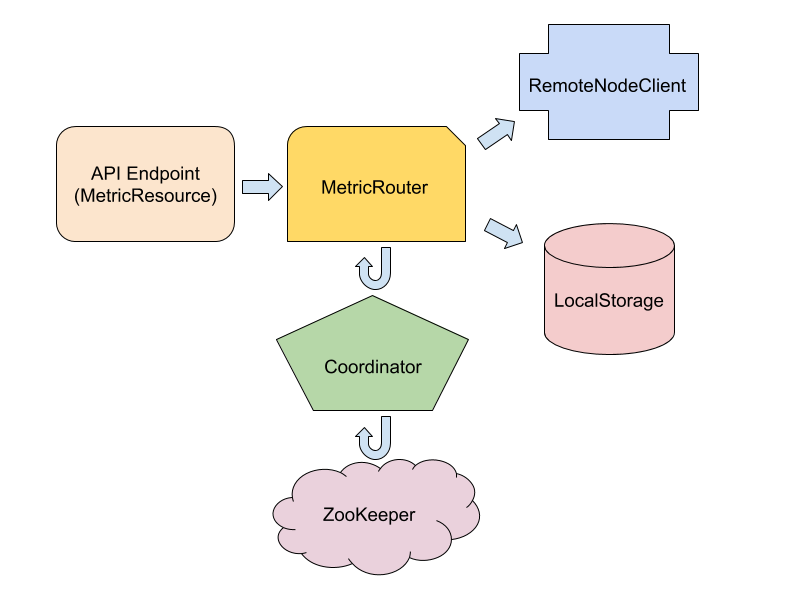

# Metrics Paradise

Let's imaging that we have a task of processing and storing large amount of IoT metrics. How would we do that? One approach is to use existing tools and technologies. Other is to design and develop the system from scratch. In these repo I will try both options.

I'll start with the first approach. Usage of well known and common products, such as databases and messaging systems seems simpler because we don't need to write code and also cheaper because we don't have to maintain it later. Also it's easier to find people familiar with these technologies. 

Before choosing right tools for the task it's better to formalize requirements. The metric processing system should be:
* Scalable
* Fast
* Self-contained 
* Able to provide aggregation statistic of processed metrics


## First approach
From the requirements it's clear that we need a database to save metrics and retrieve statistics about them. This database should be fast and scalable. Key-value databases is not very helpful here because metrics is a timeseries data that can be handled in a more clever way than just a key-value pairs. 

It's maybe wise to take a look at OLAP databases such as Druid or Clickhouse (later just CH). I've worked with Druid and I didn't like it because it was hard to setup and maintain. I'm curios about CH and I want to try it out for this task.

Clickhouse is advertised as fast and scalable. I've created the Docker Compose environment for testing this storage. CH has built in HTTP server so we can send and run queries from any device with utility such as `curl`. Each coffee machine has it these days.

To run load test just execute the command
```
./run-clickhouse-test.sh
```

It will run four nodes of CH with two shards and two replicas. Then script will create distributed table for metrics and start JMeter.

On an average machine it pushes metrics with a rate of 60 RPS.

Scaling mechanism of CH is not very convenient. The cluster nodes are listed in the config file. When it's time to add more instances each config file must be redeployed. Config files can't be redeployed on a working node therefore each node have to be switched off. Common case is to redeploy new configuration on one set of replicas than on another. This method lowers fault tolerance of the system.

Also CH is crashing on malformed queries.

I didn't like the scaling ability of CH and I got excited about building truly scalable storage system by myself.

## Second approach

*Building a scalable storage system which one can be proud of.*

The new distributed database has humble name of Metrics Paradise. Core of it's features:

* __Easily scalable.__
Just by starting the new Node every other node knows about it and automatically rebalances it's data.
* __Easily downscalable.__ 
Node can be disabled by REST API. Before shutting down it will rebalnce it's data to the other nodes. No data loss!
* __Has secured HTTP interface.__
It doesn't matter to which node metrics gets pushed. They will be stored on the right node. Same thing with queries. They can be run on every node.
* __Fast.__
One node can handle up to 6K RPS on an average machine. It's like a whole green house of thermometers.
* __Self-contained.__
Independent from external services. It doesn't need messaging systems or databases. It depends on ZooKeeper though but every cool peace of software today needs ZooKeeper so it's a plus.

### Building and running

Note: Instead of writing additional service for sending metrics I decided to practice and become more familiar with a JMeter.

Prerequisits
* Java 8
* Maven
* Docker

To build Docker image
```
mvn package
```

To run two node cluster and performance test on it
```
docker-compose --project-name metrics-paradise up
```
Also it will start Grafana with beautiful dashboard of service metrics. Credentials are `admin/admin`.
<http://localhost:3000/d/cvQIZ84ik/metrics-paradise?refresh=5s&orgId=1&from=now-30m&to=now&theme=light>

To start JMeter again with other test plan
```
docker run --rm -it --network=metrics-paradise_default --name mp-jmeter \
 -v ${PWD}/config/20k-10thread.jmx:/tests/test.jmx justb4/jmeter -n -t "/tests/test.jmx"
```
Shutdown services
```
docker-compose --project-name metrics-paradise down
```

### Example queries

Put metrics
```
echo -ne "1000000\tmetricc1\t0.5\n1000001\tmetricc2\t0.7\n" | POST http://localhost:8080/metrics
```

Query group of metrics
```
GET 'http://localhost:8080/metrics?time_start_sec=0&time_end_sec=20000000&metric_name=metricc1&metric_name=metricc2'
```

Query minimal values of group of metrics
```
GET 'http://localhost:8080/metrics?time_start_sec=0&time_end_sec=20000000&metric_name=metricc1&metric_name=metricc2&aggr_type=min'
```
Response would be a tsv text with aggregations in the same order as in the query. For querying other types of aggregation set query parameter `aggr_type` to values `min`, `max`, `mean`.

### Results of performance testing

200 000 metrics has size of 5MB on a file system. 

Single instance consumes 200k metrics from 10 client at a rate of 6k RPS.

Select queries processed at a rate of 5 RPS on a set of 200k metrics.

### Architecture


### Limitations

* No metric processing. Only storaging.
* Slow. The underlying database is single threaded.
* Slow rebalances. Rebalances not uses the ability to bulk load the data.


